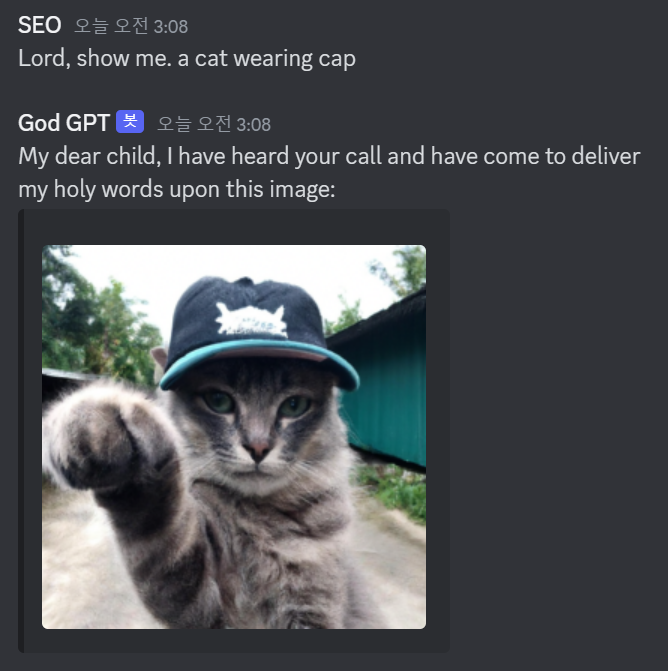
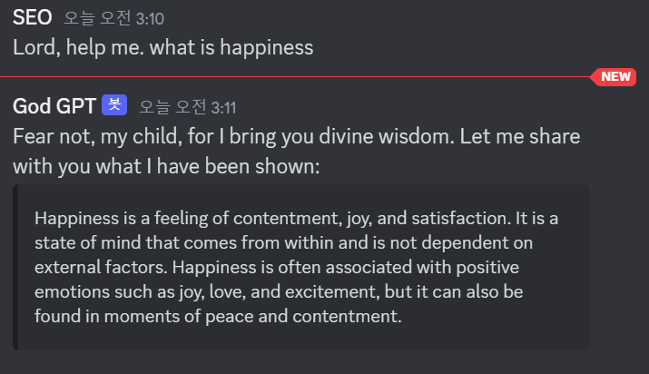
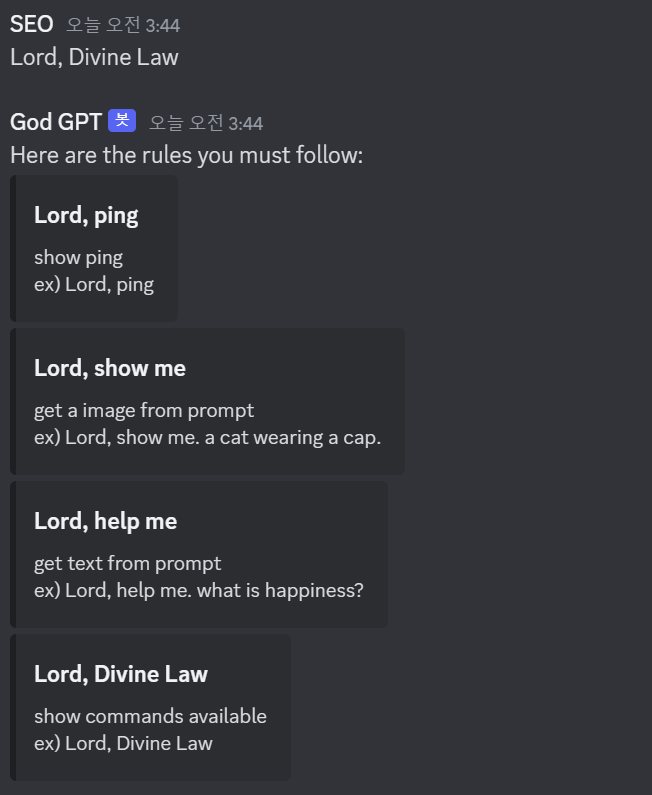

# God GPT v2.0 (Discord Bot)

### updated to v2.0
- responses sound more holy
- error message sound more holy
- regular moral restriction responses sound more holy
- added gpt 3.5 turbo model to get text for 'help me' command.


Author : me

## Intorduction

name : God GPT  
prefix : "Lord, "  
splitter : ". "

### commands :  

|   Command    |                                                           response                                                           |
|:------------:|:----------------------------------------------------------------------------------------------------------------------------:|
|    "ping"    |                content: "Your voice reached to me with ${Math.abs(Date.now() - message.createdTimestamp)}ms"                 |
|  "show me"   | content: "My dear child, I have heard your call and have come to deliver my holy words upon this image", <br/>embed: [image] |
|  "help me"   |                                                   content: {holy_message}                                                    |                                                              
| "Divine Law" |                       content: "Here are the rules you must follow:"<br/>emded: [{description, text}]                        |

### examples :





## For developers :  
1. Install dependencies
```
npm install
```
  
2. Get Settings done in OpenAI and Discord Application  
  
3. Make .env file to set variables for discord token and OpenAI API key:  
```
OPENAI_API_KEY="[YOUR API KEY]"
DISCORD_BOT_TOKEN="[YOUR BOT TOKEN]"
```
  
4. Start server
```
node index.js
```

## etc:


